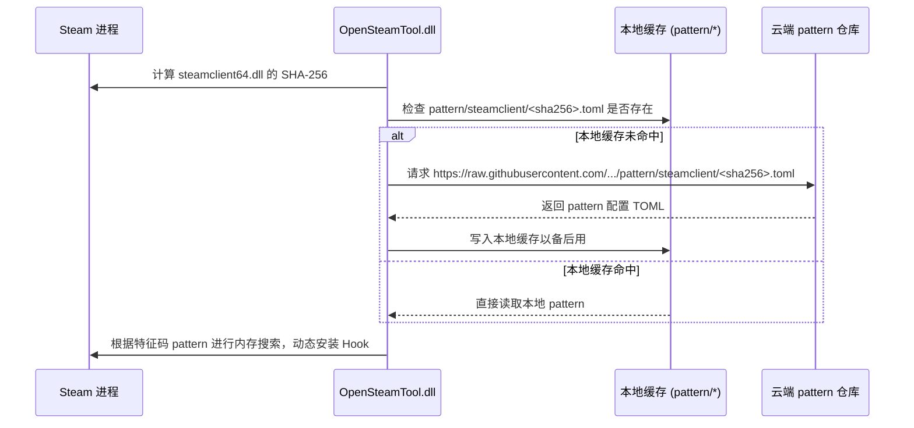

# OpenSteamTool 底层架构与原理机制

本篇详述 OpenSteamTool 核心功能的底层实现原理与 Hook 机制，供开发者和 AI 助手维护项目时参考。

---

## 1. 启动拦截机制：DLL Hijacking (Proxy DLL)

为了让 OpenSteamTool 的代码注入到 `steam.exe` 进程中，项目采用了 **Proxy DLL 劫持技术**。

### 为什么选择 `dwmapi.dll` / `xinput1_4.dll`？
- 当 Steam 启动时，Windows Loader 会根据其输入表寻找所需的系统动态链接库。根据 Windows 默认的 DLL 搜索路径，当前目录优先级高于系统的 `System32` 目录。
- OpenSteamTool 构建了同名的伪造 DLL，并将其放置在 Steam 根目录下。当 `steam.exe` 运行并加载它们时，劫持 DLL 的 `DllMain` 将被触发。

### 导出函数转发与核心注入
1. **转发机制**：伪造的 DLL 必须导出原版系统 DLL 的所有公开 API（对于 `xinput1_4.dll` 通过 `.def` 文件定义；对于 `dwmapi.dll` 通过 C++ 代码定义转发），利用 `GetProcAddress` 动态加载系统的 `C:\Windows\System32\<dll>` 并将所有调用完美转发过去，以防止 Steam 因找不到符号而崩溃。
2. **核心 DLL 注入**：劫持 DLL 的 `DllMain` 在执行初始化时，通过 `LoadLibrary("OpenSteamTool.dll")` 加载我们的主力逻辑 DLL。

---

## 2. 规避 Loader Lock 与异步初始化

Windows 系统的 `DllMain` 运行在 Loader Lock（加载器锁）保护下，此时如果进行磁盘 I/O、复杂的网络拉取、或者初始化 Hook 库（如 MinHook），极易造成进程死锁。

- **解决方案**：在 `OpenSteamTool.dll` 的 `DllMain` 中，仅执行 `DisableThreadLibraryCalls` 并使用 `OSTPlatform::Thread::StartDetached` 开启一个新的独立工作线程 `InitThread`，随后立即返回。
- 所有实质性的初始化工作（加载配置、哈希计算、内存特征码扫描、安装 Hook）均在这个不受 Loader Lock 限制的后台线程中异步执行。

---

## 3. 动态特征码扫描与云端同步 (Pattern Matching)

Steam 客户端经常频繁更新，每一次更新都会改变 `steamclient64.dll` 和 `steamui.dll` 的内存偏移量。为了避免工具频繁失效，项目不采用硬编码偏移地址，而是实现了**云端特征码拉取方案**：

### 匹配与拉取流程

- **特征码内容**：TOML 配置文件中包含了各个 Hook 目标函数的特征码（Sig）、掩码（Mask）以及特征码内部的目标指令偏移值（Operand Offset）。
- **回退机制**：如果 GitHub Raw 网络不可达，代码会自动无缝回退到 jsDelivr CDN 镜像。如果远程返回 404（表明上游尚未为此 Steam 版本提供特征码），则尝试回退到之前的本地缓存；若无缓存，则弹窗警告并禁用该模块相关的 Hook 点，保证 Steam 其余部分仍可工作。

---

## 4. 跨进程 IPC 拦截机制 (IPCProcessMessage)

Steam 客户端使用了跨进程的 IPC 通信（例如，`steam.exe` 作为服务端进程，SteamUI (CEF 渲染进程) 和运行的游戏作为客户端进程，彼此通过命名管道及共享内存通信）。

- **拦截核心**：Hook 了 `steamclient64.dll` 导出的内部函数 `IPCProcessMessage`。
- **消息处理流程**：
  - `IPCProcessMessage` 会传入 `CUtlBuffer* pRead` (收到的请求包) 和 `CUtlBuffer* pWrite` (待写入的响应包)。
  - 我们通过 `IPCLoader` 解析出当前调用的 Interface 名称和 Method 名称。
  - 项目在 `Hooks_IPC_ISteamUser` 与 `Hooks_IPC_ISteamUtils` 中注册了针对具体方法（如 `RequestEncryptedAppTicket`、`GetSteamID`）的 `pre`（前置拦截）与 `post`（后置修改）回调。
  - 在 `post` 阶段，通过直接反序列化/修改 `pWrite` 缓存区中的结构化字段，从而实现了对 IPC 响应数据的动态篡改。

---

## 5. WebSocket 网络包拦截点

Steam 的客户端也通过 WebSocket（通常为基于 Protobuf 的二进制帧）与 Valve 云端服务直接通信。

- **Hook 点**：Hook 了 WebSocket 的发送和接收入口：
  - `BBuildAndAsyncSendFrame`: 拦截由客户端发出的网络包。
  - `RecvPkt`: 拦截从 Valve 服务器收到的网络数据包。
- **工作机制**：
  - 将原始数据包解包为 Steam 协议中的 `EMsg` (消息 ID) 加上 Protobuf Body。
  - 拦截 `k_EMsgClientPICSProductInfoRequest` 等请求，并重写对应的 Protobuf 包体，或者在接收到 RPC 服务响应 `k_EMsgServiceMethodResponse` 时重写 DLC 和游戏所有权数据包，从而让 Steam 客户端确信用户已“拥有”此游戏/DLC。

---

## 6. Denuvo 与 SteamStub 保护的游戏授权原理

被 Denuvo 或 SteamStub 加密保护的游戏在启动时，不仅会向 Steam 客户端发送常规的授权检测，还需要从客户端获取针对当前 AppId 的加密凭据（AppTicket/ETicket）。

1. **凭据捕获与平台存储**：
   - 提取工具 `extract_tickets` 允许玩家在真正拥有该游戏的电脑上，从内存和注册表中转储出原始的 `appticket.bin` 与 `eticket.bin`。
   - 在 Lua 脚本中通过 `setAppTicket` 与 `setETicket` 提供的十六进制字符串，会被 OpenSteamTool 写入本地凭据存储。
   - Windows 上的当前实现路径为注册表：`HKCU\Software\Valve\Steam\Apps\<AppId>\AppTicket`（和 `ETicket`）。
2. **IPC 欺骗**：
   - 当受保护的游戏启动并通过 IPC 请求加密的 AppTicket 时，`Hooks_IPC_ISteamUser::GetEncryptedAppTicket` 被触发。
   - 钩子会优先尝试读取我们在凭据存储中设置的显式 AppTicket。如果不存在，则通过 SteamDRMP 令牌解析漏洞自动伪造/重用本地 ConfigStore 的缓存令牌。
